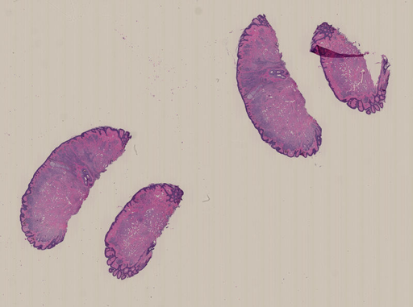
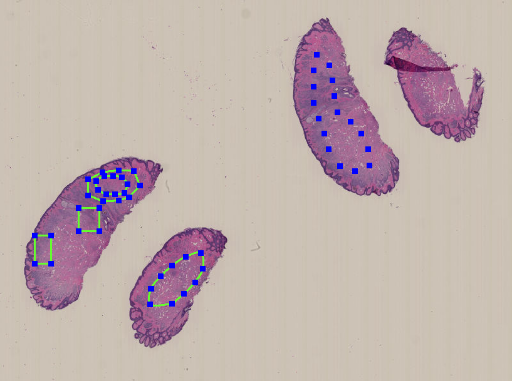
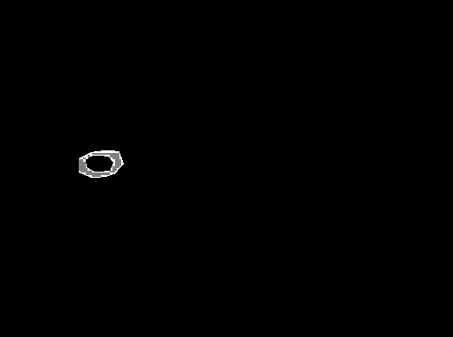

# Description
Utility script for ASAP.

# What it does
- Cut out patches from the area you set with ASAP
- Cut out rectangles you set with ASAP

# How to run
```
python converter.py [-h] [-s SIZE] [-ov OVERLAP] [-a ANNOTATION]
       [-od OUTPUT_DIR] [-t THRESH] [-c CLASSES] [-sm]
       [-m {rect,non_rect,all}]
       wsi

```

# Sample

### Image

- Thumbnail of CMU-1.ndpi



- Annotation sample using ASAP



- Mask image to represent the extracted area as gray.


### Code

(1) Run the code below to get free distributed sample "CMU-1.ndpi".

`./samples/CMU-1.ndpi_download.sh`


(2) Run the code below and wait until the script ends.

`python converter.py samples/CMU-1.ndpi`

# Did it really work?

- After running the sample code, check `samples/CMU-1/masks_saved` to see the areas extracted from the wsi with this script. Script will save images per classes, with the extracted area covered with gray color.

# Advanced settings

| Argument   | Description | Example | Default |
|:----------:|------------|:-----------:|:---:|
| size       | The length of each side of patches.            | 224         |254
| overlap    | Overlap size for each patches. |      16 | 1 |
| output_dir | The output directory to save the results. |        ./output | same as wsi |
| thresh     | The threshold value to decide whether a patch is in the annotation area. | 0.8          |1.0|
| classes    | A file to mannualy define the classes. You can set [extra rules]() here. | samples/CMU-1.txt | all the groups set in the xml file. |
| save_mask  | Whether to save the mask of original wsi size. | -m (if set, True) | False |
| mode       | Annotation type to cut out. You can choose "rect" for cutting out only Type Rectangle, "non_rect" for cutting out of annotations except for Type Rectangle, "all" for cutting all annotations. | all | all |

# Extra rule
- If you want to exclude specific area in an annotated area, you can set a extra rule in the "-c" "--classes" file. sample/CMU-1.txt is the smaple file.
- Each line means [group name] [exclude group name] [exclude group name]...
- If you use sample/CMU-1.txt, "splines" annotation area will be excluded from "polygons" area. This makes a saved mask like below.




# ASAP
[github page](https://github.com/computationalpathologygroup/ASAP)